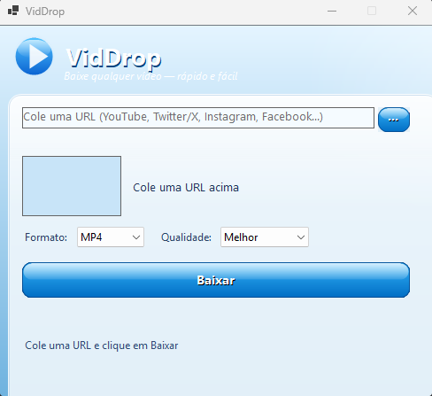

<div align="center">

# VidDrop

### Baixador de vídeos gratuito, open source e sem anúncios para Windows

*Free, open source, ad-free video downloader for Windows*

[](https://github.com/shukamis/viddrop/releases/latest)
[](https://github.com/shukamis/viddrop/releases/latest)
[](LICENSE)
[](https://github.com/shukamis/viddrop)

**YouTube · Twitter/X · Instagram · Facebook · TikTok**

Cole a URL → escolha o formato → baixe. Simples assim.

---

</div>

## Interface

<div align="center">
  
</div>

---

## Por que o VidDrop?

| | VidDrop | Outras ferramentas |
|---|---|---|
| Gratuito | ✅ | Às vezes |
| Sem anúncios | ✅ | Raramente |
| Open source | ✅ | Raramente |
| Sem instalação de Python/CLI | ✅ | Depende |
| Auto-update silencioso | ✅ | Raramente |
| Interface limpa | ✅ | Varia |

---

## Plataformas suportadas

Baixe vídeos e áudios de qualquer uma dessas plataformas:

- **YouTube** — vídeos, shorts, playlists
- **Twitter / X** — vídeos de tweets
- **Instagram** — reels, posts com vídeo
- **Facebook** — vídeos públicos
- **TikTok** — vídeos sem marca d'água
- E qualquer outra plataforma suportada pelo [yt-dlp](https://github.com/yt-dlp/yt-dlp/blob/master/supportedsites.md)

---

## Recursos

<div align="center">

| Recurso | Detalhes |
|---|---|
| Formatos | MP4 (vídeo) · MP3 (áudio) |
| Qualidade de vídeo | Melhor, 1080p, 720p, 480p, 360p |
| Bitrate de áudio | 320 · 192 · 128 · 64 kbps |
| Pré-visualização | Thumbnail + título automáticos ao colar a URL |
| Modo em lote | Carrega um `.txt` com várias URLs de uma vez |
| Progresso | Barra multi-etapa com cancelamento a qualquer hora |
| Auto-update | Atualização silenciosa via Velopack ao iniciar |
| Pasta de saída | Salva direto em `Downloads\` sem subpastas |

</div>

---

## Como usar

### Modo fácil — instalar e usar em 3 passos

**1.** Acesse a página de [**Releases**](https://github.com/shukamis/viddrop/releases/latest) e baixe o instalador mais recente

**2.** Execute o instalador — não precisa instalar mais nada (yt-dlp e ffmpeg já vêm embutidos)

**3.** Abra o VidDrop, cole uma URL, escolha o formato e clique em **Baixar**

> O arquivo vai direto para a sua pasta `Downloads`. Sem configuração, sem terminal.

---

### Baixar vários vídeos de uma vez (modo lote)

1. Crie um arquivo `.txt` com uma URL por linha:
   ```
   https://youtube.com/watch?v=...
   https://twitter.com/user/status/...
   https://www.tiktok.com/@user/video/...
   ```
2. Dentro do app, clique no botão **lote**
3. Selecione o arquivo — os downloads começam automaticamente na sequência

---

## Compilar do zero

> *For contributors and developers — build from source*

### Pré-requisitos

- [.NET 8 SDK](https://dotnet.microsoft.com/download)
- Windows 10 ou 11 (WinForms exige Windows)
- [yt-dlp.exe](https://github.com/yt-dlp/yt-dlp/releases/latest) + [ffmpeg.exe](https://github.com/BtbN/FFmpeg-Builds/releases) — coloque ambos em `Tools\`

### Passos

```bash
# 1. Clonar o repositório
git clone https://github.com/shukamis/viddrop.git
cd viddrop

# 2. Adicionar os binários em Tools\
#    (yt-dlp.exe e ffmpeg.exe — links acima)

# 3. Rodar em modo desenvolvimento
dotnet run

# 4. Publicar build auto-contida
dotnet publish -c Release -r win-x64 --self-contained
```

Os binários em `Tools\` são copiados automaticamente para a pasta de saída (configurado no `.csproj`).

---

## Estrutura do projeto

```
VidDrop/
├── UI/          — MainForm, AeroButton, AeroProgressBar (estilo Frutiger Aero)
├── Core/        — DownloadCoordinator, MetadataFetcher, DownloadEngine,
│                  ProgressParser, SelfUpdater, UpdateChecker
├── Process/     — YtDlpProcessRunner (único dono de Process), ToolLocator
├── Models/      — VideoMetadata, DownloadOptions, DownloadProgress, MediaFormat
├── Errors/      — DownloadException, ErrorClassifier
├── Installer/   — script de build Velopack
└── Tools/       — yt-dlp.exe + ffmpeg.exe (não estão no repo — adicionar manualmente)
```

---

## Tecnologias

- **C# / .NET 8** — WinForms, publicação auto-contida win-x64
- **[YoutubeDLSharp](https://github.com/Bluegrams/YoutubeDLSharp)** — wrapper para yt-dlp
- **[yt-dlp](https://github.com/yt-dlp/yt-dlp)** — motor de download (embutido)
- **[ffmpeg](https://ffmpeg.org/)** — mux/transcode (embutido, build LGPL)
- **[Velopack](https://velopack.io/)** — auto-update + instalador

---

## Contribuindo

Pull requests são bem-vindos! Para mudanças grandes, abra uma issue primeiro para discutir o que você gostaria de mudar.

---

<div align="center">

## Licença

MIT © [Arthur Shukamis](https://github.com/shukamis) — veja [LICENSE](LICENSE)

*yt-dlp e ffmpeg são distribuídos sob suas próprias licenças (Unlicense / LGPL-2.1)*

</div>
